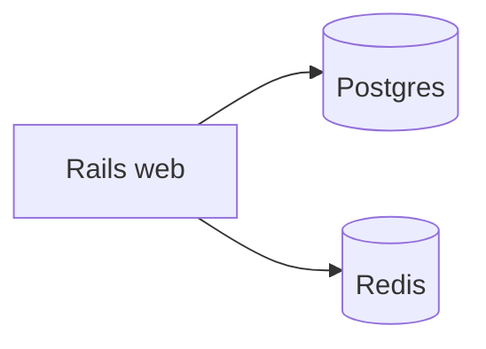

# Diagrams

Architecture and flow diagrams for this repo — the visual half of the **Map** role.

## Prefer mermaid in a `.md` file

Write diagrams as mermaid inside a markdown file here (for example `architecture.md`). GitHub
renders mermaid natively, and Claude renders it in artifacts, so the diagram stays readable
without a plugin — and because it is text, it diffs in review and can be edited by an agent.

````

````

## Binary exports

Only when a tool genuinely cannot emit mermaid (a rendered screenshot, a vendor diagram).
Commit the source alongside the export where one exists, so it can be regenerated rather than
redrawn.

## Keep them honest

A diagram that no longer matches the code is worse than none, because it is believed. If you
change a boundary shown here, update the diagram in the same change or delete it.
